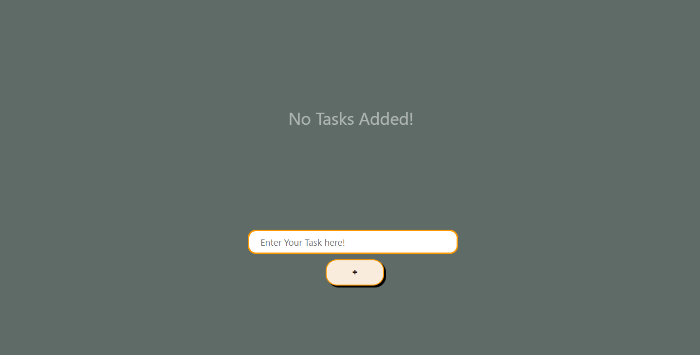
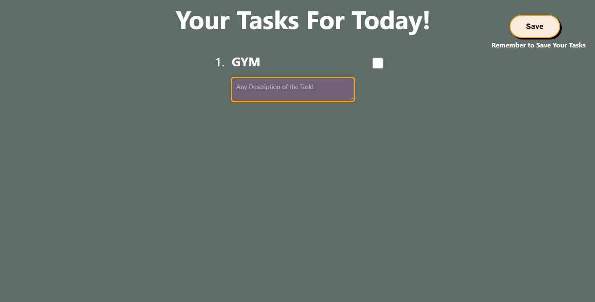

# 📝 Dynamic To-Do App

A simple yet dynamic to-do list application that allows users to add, edit, delete, and mark tasks as complete.  
Built with HTML, CSS, and JavaScript.

## Live Demo : 
Click here to try the app 👉 (https://Srihari-07.github.io/dynamic-todo-app/)

## Screenshots : 

## ✨ Features : 
- ➕ Add new tasks instantly
- ✏️ Add it's Description
- ✅ Mark tasks when completed
- ❌ Delete tasks after completion 
- 💾 Saves tasks in browser local storage (persistent even after refresh)

## 🛠 Tech Stack :
- **HTML5** -> Structure
- **CSS3** -> Styling
- **JavaScript (ES6)** —> Logic & Interactivity
- **Local Storage API** —> Data persistence

## 📚 What I Learned :
While building this project, I learned:
- How to manipulate the DOM dynamically with JavaScript
- How to approach bugs and solve them
- Saving and retrieving data from `localStorage`
- Basic Git & GitHub workflow

